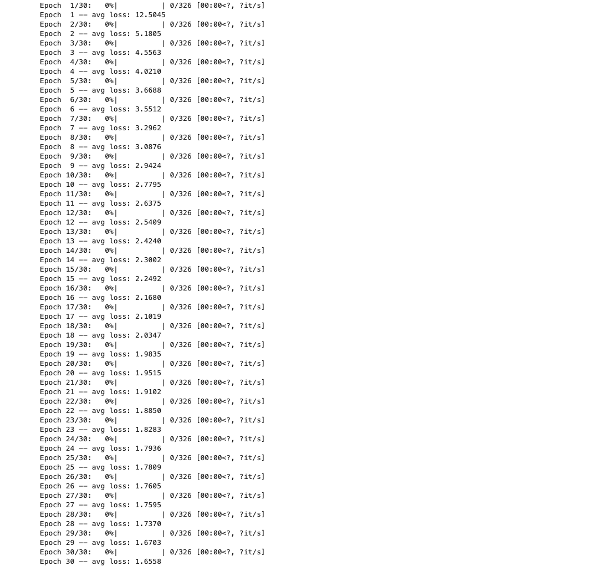
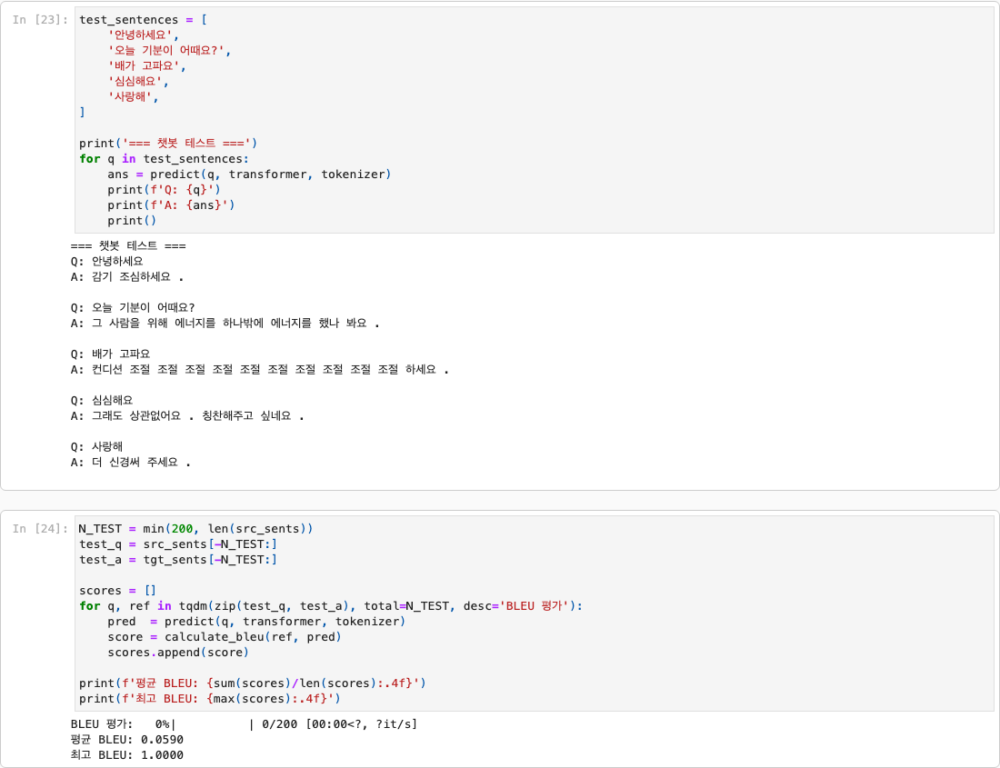
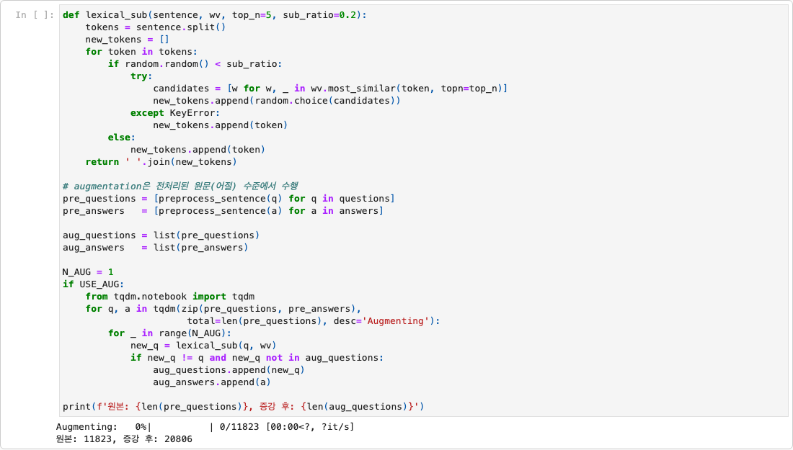
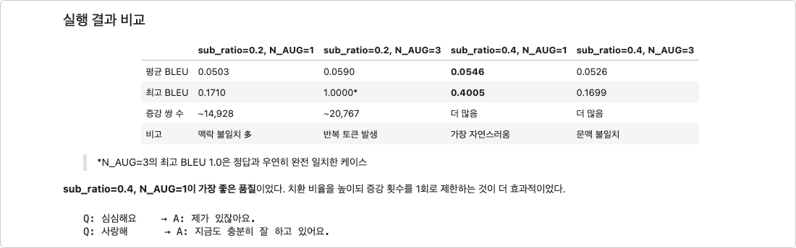

# AIFFEL Campus Online Code Peer Review Templete
- 코더 : 채진현
- 리뷰어 : 최승현

# PRT(Peer Review Template)
- [x]  **1. 주어진 문제를 해결하는 완성된 코드가 제출되었나요?**
    - 문제에서 요구하는 최종 결과물이 첨부되었는지 확인
        - 중요! 해당 조건을 만족하는 부분을 캡쳐해 근거로 첨부

    **리뷰어 의견:** `project.ipynb`에 Step 1~7이 모두 구현되어 있고, 30 epoch 학습이 완료되었으며 Step 7에서 챗봇 테스트와 BLEU 평가(평균 0.0590)까지 수행된 완성본입니다.

    

    
    
- [ ]  **2. 전체 코드에서 가장 핵심적이거나 가장 복잡하고 이해하기 어려운 부분에 작성된 
주석 또는 doc string을 보고 해당 코드가 잘 이해되었나요?**
    - 해당 코드 블럭을 왜 핵심적이라고 생각하는지 확인
    - 해당 코드 블럭에 doc string/annotation이 달려 있는지 확인
    - 해당 코드의 기능, 존재 이유, 작동 원리 등을 기술했는지 확인
    - 주석을 보고 코드 이해가 잘 되었는지 확인
        - 중요! 잘 작성되었다고 생각되는 부분을 캡쳐해 근거로 첨부
        
- [x]  **3. 에러가 난 부분을 디버깅하여 문제를 해결한 기록을 남겼거나
새로운 시도 또는 추가 실험을 수행해봤나요?**
    - 문제 원인 및 해결 과정을 잘 기록하였는지 확인
    - 프로젝트 평가 기준에 더해 추가적으로 수행한 나만의 시도, 
    실험이 기록되어 있는지 확인
        - 중요! 잘 작성되었다고 생각되는 부분을 캡쳐해 근거로 첨부

    **리뷰어 의견:** MeCab 설치 실패 후 SentencePiece BPE로 전환한 기록이 회고에 남아 있고, `sub_ratio × N_AUG` 4조합 증강 실험을 BLEU 표로 비교한 점이 인상적입니다. N_AUG=3 반복 토큰 문제도 원인과 함께 분석했습니다.

    

    
        
- [ ]  **4. 회고를 잘 작성했나요?**
    - 주어진 문제를 해결하는 완성된 코드 내지 프로젝트 결과물에 대해
    배운점과 아쉬운점, 느낀점 등이 기록되어 있는지 확인
    - 전체 코드 실행 플로우를 그래프로 그려서 이해를 돕고 있는지 확인
        - 중요! 잘 작성되었다고 생각되는 부분을 캡쳐해 근거로 첨부
        
- [ ]  **5. 코드가 간결하고 효율적인가요?**
    - 파이썬 스타일 가이드 (PEP8) 를 준수하였는지 확인
    - 코드 중복을 최소화하고 범용적으로 사용할 수 있도록 함수화/모듈화했는지 확인
        - 중요! 잘 작성되었다고 생각되는 부분을 캡쳐해 근거로 첨부

# 회고(참고 링크 및 코드 개선)

채진현님 프로젝트는 **증강 실험 설계와 회고 분석**이 가장 돋보였습니다. 특히 BPE 토큰화 선택 이유와 4조합 하이퍼파라미터 비교는 과제 요구를 넘어선 시도로 보입니다.

**잘한 점**
- Step 1~7 파이프라인 완료, 학습·평가 결과가 노트북에 남아 있음
- SentencePiece BPE 전환 및 증강 실험을 표로 정리함
- 반복 토큰, BLEU 한계 등을 회고에서 구체적으로 짚음

**아쉬운 점**
- 핵심 함수(`lexical_sub`, `train_step` 등) docstring 부족
- 실행 플로우 mermaid 그래프 없음 (`result_combined.png`도 repo에 없음)
- train/val 분리, Early Stopping, Beam Search 미적용

**참고 링크**
- [SentencePiece](https://github.com/google/sentencepiece) — BPE 토큰화
- [NLTK BLEU Score](https://www.nltk.org/api/nltk.translate.bleu_score.html) — Step 7 평가 지표
