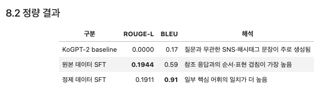
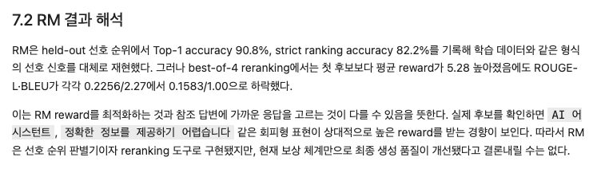
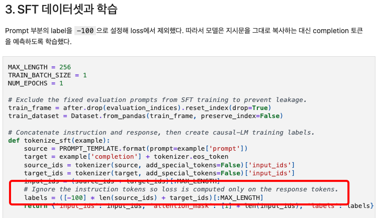
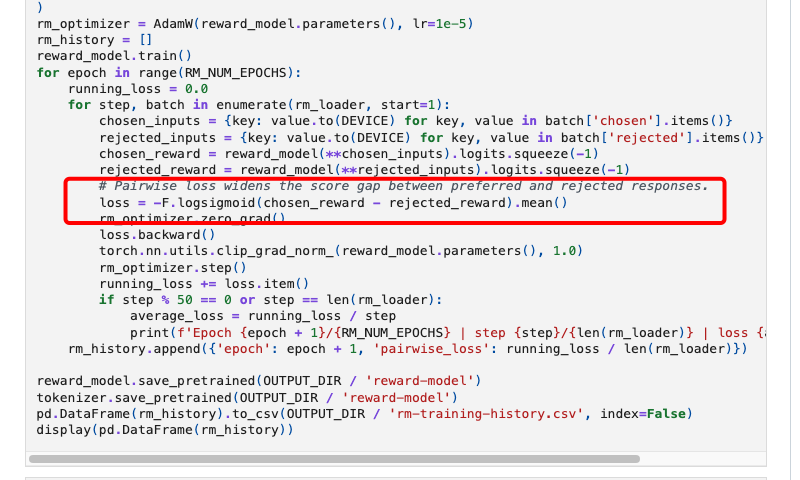
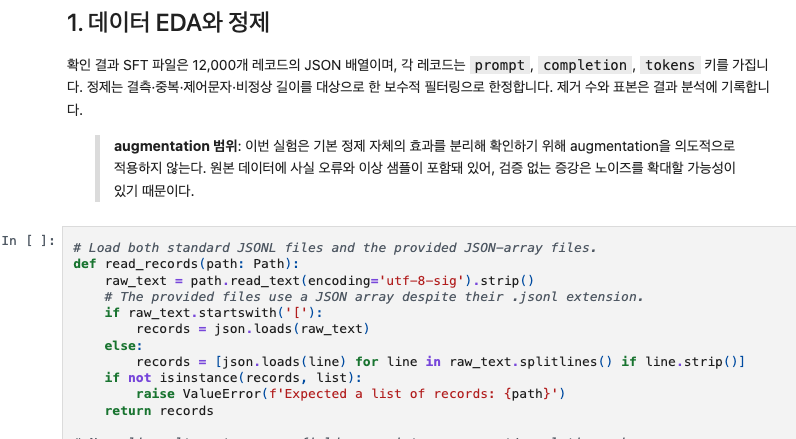
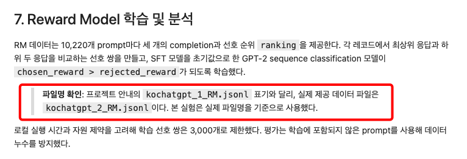
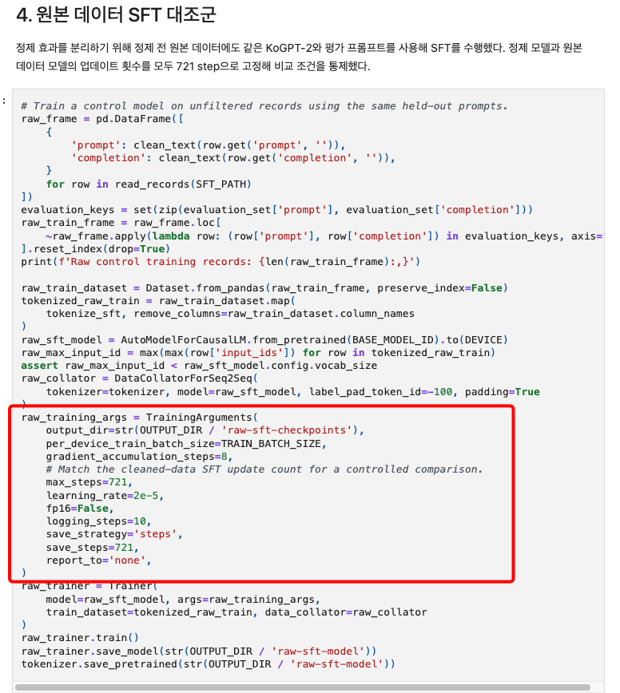
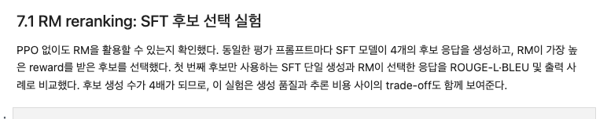
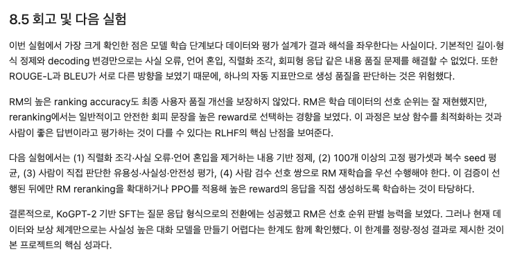
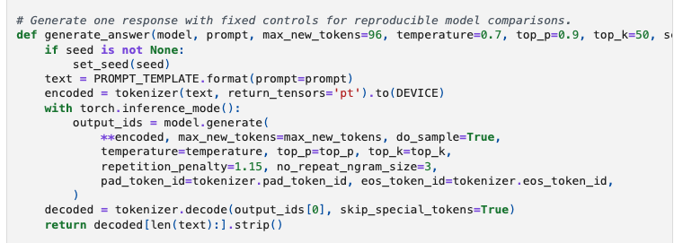

# AIFFEL Campus Online Code Peer Review Templete
- 코더 : 채진현
- 리뷰어 : 김민욱


# PRT(Peer Review Template)
- [x]  **1. 주어진 문제를 해결하는 완성된 코드가 제출되었나요?**
    - 데이터 EDA·정제부터 SFT 학습, 생성 전략 비교, Reward Model 학습, RM reranking, 결론까지 끊기는 부분 없이 끝까지 이어져 있습니다.
    - 루브릭의 세 가지(데이터 정제로 성능 향상 / RM 구현 / 기존 KoGPT-2와 SFT 비교)가 정량 표로 한 번에 정리되어 있어서 확인하기 편했습니다. 정제 데이터와 beam search를 합친 조합이 원본 SFT를 두 지표 모두에서 넘었다는 결론까지 명확했습니다.  
          
    - Reward Model 쪽도 Top-1 preference accuracy 90.8%, strict ranking accuracy 82.2% 로 수치가 나와 있어서 RM이 실제로 선호를 구분하고 있다는 게 보였습니다.  
          
    - 노트북에 셀 실행 결과(output)는 저장되어 있지 않아서, 위 숫자들은 마크다운 정리 부분을 기준으로 확인했습니다. 로컬 GPU로 다시 돌리기가 번거로우셨을 것 같은데, 나중에 여유 있을 때 출력까지 같이 저장해두시면 읽는 사람이 표와 생성 예시를 바로 볼 수 있을 것 같습니다.

- [x]  **2. 전체 코드에서 가장 핵심적이거나 가장 복잡하고 이해하기 어려운 부분에 작성된 주석 또는 doc string을 보고 해당 코드가 잘 이해되었나요?**
    - 제가 이 프로젝트에서 제일 헷갈렸던 부분이 SFT 학습 라벨을 만드는 곳이었는데, `labels = ([-100] * len(source_ids) + target_ids)` 위에 지시문 토큰은 loss에서 빼고 응답 토큰만 예측하게 한다는 주석이 달려 있어서 왜 -100을 넣는지 바로 이해됐습니다.  
          
      
    - 그리고 가장 핵심이라고 생각한 건 Reward Model 학습 루프의 `loss = -F.logsigmoid(chosen_reward - rejected_reward).mean()` 한 줄입니다. RM은 정답을 맞히는 게 아니라 좋은 답과 나쁜 답의 점수 차이를 벌리도록 배우는 모델인데, 그 개념이 이 한 줄에 다 들어 있어서 제일 어려운 곳이라고 봤습니다. 바로 위에 선호/비선호 점수 격차를 벌린다는 주석이 있어서 수식과 코드를 연결해 읽을 수 있었습니다.  
          
      
    - 주석이 영어로 되어 있는데 문장이 짧고 명확해서 읽는 데 어려움은 없었습니다. 다만 설명 셀은 한국어라, 주석도 한국어였으면 더 빨리 읽혔을 것 같기도 합니다.

- [x]  **3. 에러가 난 부분을 디버깅하여 문제를 해결한 기록을 남겼거나 새로운 시도 또는 추가 실험을 수행해봤나요?**
    - 제공된 파일이 확장자는 `.jsonl` 인데 실제로는 JSON 배열이라는 걸 찾아내고, 두 형식을 모두 읽는 로더를 따로 만든 부분이 좋았습니다. 저도 같은 데이터에서 처음에 한 줄씩 읽다가 막혔던 기억이 있어서 반가웠습니다.  
          
    - 안내 문서의 `kochatgpt_1_RM.jsonl` 과 실제 파일명 `kochatgpt_2_RM.jsonl` 이 다르다는 점도 그냥 넘어가지 않고 노트북에 적어두신 게 인상적이었습니다.  
          
    - 정제 효과만 따로 보려고 원본 데이터로도 같은 조건의 대조군을 학습시키고, `max_steps=721` 로 업데이트 횟수까지 맞춘 부분이 이 노트북에서 제일 공들인 실험 설계라고 생각합니다. 이렇게 해야 성능 차이가 정제 때문인지 학습량 때문인지 구분이 되는데, 거기까지 통제하신 게 좋았습니다.  
          
    - PPO 대신 RM으로 후보 4개 중 보상이 가장 높은 것을 고르는 best-of-4 reranking을 해보신 것도 새로운 시도라 재미있게 봤습니다. 게다가 보상은 평균 5.28 올랐는데 ROUGE-L·BLEU는 오히려 떨어졌다는 결과를 숨기지 않고 그대로 적고, RM이 "정확한 정보를 제공하기 어렵습니다" 같은 회피형 문장에 높은 점수를 준다는 원인 해석까지 붙이신 점이 제일 좋았습니다.  
          

- [x]  **4. 회고를 잘 작성했나요?**
    - 마지막 8.5 회고에 배운 점(학습 단계보다 데이터와 평가 설계가 결과 해석을 좌우한다), 아쉬운 점(정제와 decoding 변경만으로는 사실 오류를 못 잡았다), 다음에 할 것 네 가지가 순서대로 정리되어 있어서 읽기 좋았습니다.  
          
    - 특히 ROUGE-L과 BLEU가 서로 다른 방향을 가리켰기 때문에 자동 지표 하나만 믿으면 위험하다고 적으신 부분은, 제 노트북에도 넣었어야 했다 싶을 만큼 공감이 됐습니다.
    - 다만 전체 실행 플로우를 그린 그림은 따로 없었습니다. 섹션 번호가 순서대로라 흐름을 따라가는 데 큰 문제는 없었지만, 데이터 정제 -> SFT -> RM -> reranking 정도의 간단한 그림이 앞쪽에 하나 있으면 처음 여는 사람이 더 편할 것 같습니다.

- [x]  **5. 코드가 간결하고 효율적인가요?**
    - 반복되는 작업이 대부분 함수로 빠져 있어서 셀이 짧고 읽기 쉬웠습니다. 데이터 로딩(`read_records`), 텍스트 정리(`clean_text`), 지표 계산(`calculate_metrics`), 선호 쌍 생성(`build_preference_pairs`), 보상 계산(`reward_score`) 이 각각 따로 있어서 뒤에서 계속 재사용됩니다.
    - 그중 `generate_answer` 는 seed까지 인자로 받게 되어 있어서, 베이스라인·정제 SFT·원본 SFT를 같은 조건으로 비교할 때 계속 재사용되는 점이 좋았습니다.  
          
    - RM 학습 전에 더 이상 안 쓰는 생성 모델들을 CPU로 내리고 `torch.cuda.empty_cache()` 를 부르는 부분은, GPU 메모리 때문에 고생해본 입장에서 세심하다고 느꼈습니다.


# 회고(참고 링크 및 코드 개선)
```
[리뷰어 회고]
- 저도 같은 노드를 하면서 SFT -> RM -> PPO 까지 돌려봤는데, PPO 쪽에서 보상 점수는 올라가는데
  실제 답변 품질은 별로 나아지지 않는 현상을 봤습니다. 진현님은 PPO 대신 RM reranking으로
  같은 현상(보상 +5.28 인데 ROUGE/BLEU 는 하락)을 훨씬 적은 자원으로 깔끔하게 보여주셔서,
  이런 식으로도 확인할 수 있구나 하고 배웠습니다.
- 원본 데이터 대조군을 같은 721 step 으로 맞춘 부분은 제 노트북에는 없던 통제라, 다음 프로젝트에
  가져다 쓰려고 합니다. 비교 조건을 맞춰야 결과를 말할 수 있다는 걸 다시 느꼈습니다.
- 코드 개선 제안은 따로 적지 않았습니다. 제가 이번 노드에서 이해한 범위 안에서는 고칠 만한 곳을
  찾지 못했고, 함수 구성이나 메모리 관리는 오히려 제 코드보다 정리가 잘 되어 있었습니다.
  리뷰하면서 배운 쪽이 더 많았습니다. 고생 많으셨습니다.
```
