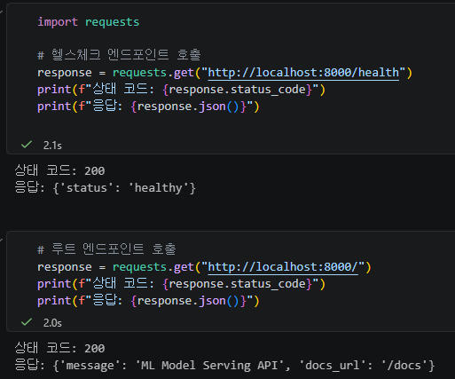
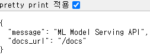
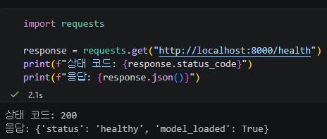
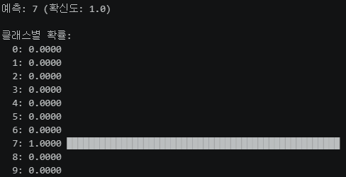
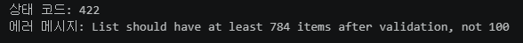
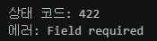

# Day 2: FastAPI 기반 모델 추론 API

## 1. 섹션 1.5 수행내역 — 최소 FastAPI 서버 실행

`app/main_basic.py`에 FastAPI 애플리케이션과 두 개의 GET 엔드포인트를 작성하고 Uvicorn으로 실행했다.

```python
@app.get("/health")
def health_check():
    return {"status": "healthy"}


@app.get("/")
def root():
    return {
        "message": "ML Model Serving API",
        "docs_url": "/docs",
    }
```

실행 및 헬스체크 결과:

```text
Uvicorn running on http://127.0.0.1:8000
상태 코드: 200
응답: {'status': 'healthy'}
```

실행 화면 캡처:





## 2. 섹션 2, 3 셀 출력 — Path·Query·Body와 Swagger UI

### Path 파라미터

```python
response = requests.get("http://localhost:8000/models/sentiment-v1")
print(response.json())
```

```text
{'model_name': 'sentiment-v1', 'status': 'running', 'version': '1.0.0'}
```

### Query 파라미터

```python
response = requests.get(
    "http://localhost:8000/models?status=running&limit=1"
)
print(response.json())
```

```text
{'total': 1, 'models': [{'name': 'sentiment-v1', 'status': 'running'}]}
```

### Request Body 및 Swagger UI

```python
data = {
    "text": "이 서비스는 정말 좋아요!",
    "return_probabilities": True,
}
response = requests.post("http://localhost:8000/predict", json=data)
print(response.json())
```

```text
{
  'label': '긍정',
  'confidence': 0.92,
  'probabilities': {'긍정': 0.92, '부정': 0.05, '중립': 0.03}
}
```

`http://localhost:8000/docs`에서 Swagger UI를 열어 같은 GET·POST 요청을 실행했다. 엔드포인트의 타입 힌트와 Pydantic 스키마가 입력 폼, 예시, 응답 스키마에 자동 반영되는 것을 확인했다.

## 3. 섹션 5 수행내역 — MNIST 추론 엔드포인트

`app/model_utils.py`에 Day 1의 모델 구조, 모델 로드 함수, 추론 함수를 작성하고 `app/main.py`의 `/predict` 엔드포인트에 연결했다. 모델은 서버 시작 시 한 번만 로드되도록 구성했다.

```text
GET /health
상태 코드: 200
응답: {'status': 'healthy', 'model_loaded': True}
```



정상 추론 요청은 784개 픽셀 값을 받아 다음과 같이 응답했다.

```json
{
  "label": 9,
  "confidence": 1,
  "probabilities": null,
  "model_version": "1.0.0"
}
```

MNIST 샘플 이미지에 대한 모델 추론에서는 숫자 7을 예측했고, 클래스 7의 확률이 1.0으로 가장 높게 나타났다.



또한 `pixel_values`의 길이가 784개가 아닌 요청은 Pydantic의 `min_length`·`max_length` 검증에 의해 `422 Unprocessable Entity`로 차단되는 것을 확인했다.



필수 입력 필드를 누락한 요청도 `422 Unprocessable Entity`로 처리되는 것을 확인했다.



## 4. 체크포인트 답변

### 섹션 1. FastAPI와 Uvicorn

#### 1. FastAPI가 Flask보다 모델 배포에 적합한 이유 세 가지는 무엇입니까?

**답변:** 타입 힌트와 Pydantic을 이용한 자동 입력 검증, OpenAPI 기반의 Swagger UI·ReDoc 자동 문서화, `async`/`await` 기반의 비동기 처리 지원이 대표적이다. 입력과 출력 형식을 명확히 유지해야 하는 모델 API에 특히 적합하다.

#### 2. Uvicorn의 역할은 무엇이며, 왜 FastAPI와 함께 사용합니까?

**답변:** Uvicorn은 ASGI 서버다. FastAPI 애플리케이션을 네트워크에서 실제 HTTP 요청으로 받을 수 있도록 실행하고, 요청을 FastAPI 앱에 전달한 뒤 응답을 클라이언트에 반환한다.

#### 3. `@app.get("/health")`에서 `get`과 `"/health"`는 각각 무엇을 의미합니까?

**답변:** `get`은 HTTP GET 메서드로 요청을 받겠다는 뜻이고, `"/health"`는 해당 요청을 처리할 URL 경로다.

#### 4. FastAPI에서 dict를 반환하면 어떤 일이 자동으로 일어납니까?

**답변:** FastAPI가 딕셔너리를 JSON으로 직렬화하고 `application/json` 응답으로 반환한다.

### 섹션 2. Path, Query, Body

#### 1. `/models/sentiment-v1`에서 `sentiment-v1`은 어떤 종류의 파라미터입니까?

**답변:** URL 경로에 포함되어 특정 리소스를 식별하는 Path 파라미터다.

#### 2. `/models?status=running&limit=5`에서 `status`와 `limit`은 어떤 종류의 파라미터입니까?

**답변:** URL의 `?` 뒤에 전달되는 Query 파라미터다. 여기서는 각각 필터 조건과 최대 반환 개수를 의미한다.

#### 3. 모델 추론 요청에 Request Body를 사용하는 이유는 무엇입니까?

**답변:** 텍스트, 이미지 픽셀, 여러 옵션처럼 길거나 구조화된 입력 데이터를 URL 길이 제한 없이 JSON으로 전달하기 좋기 때문이다. POST 요청의 본문에 입력 데이터가 담긴다.

#### 4. FastAPI에서 함수의 파라미터가 Path, Query, Body 중 어디서 오는지 어떻게 판별합니까?

**답변:** 경로 문자열의 `{변수명}`과 이름이 같으면 Path 파라미터다. Pydantic `BaseModel` 타입의 인자는 Request Body로 해석된다. 나머지 단순 타입 인자는 기본적으로 Query 파라미터가 된다.

### 섹션 3. Swagger UI

#### 1. FastAPI에서 Swagger UI에 접속하려면 어떤 URL로 이동합니까?

**답변:** 서버 주소 뒤에 `/docs`를 붙인다. 예: `http://localhost:8000/docs`.

#### 2. Swagger UI가 코드와 항상 동기화될 수 있는 이유는 무엇입니까?

**답변:** FastAPI가 라우트 선언, 타입 힌트, Pydantic 모델을 바탕으로 OpenAPI 스펙을 자동 생성하고 Swagger UI가 그 스펙을 읽어 문서를 만들기 때문이다.

#### 3. Pydantic 모델의 `Field(description=, examples=)`는 Swagger UI의 어디에 반영됩니까?

**답변:** 요청 본문 스키마의 각 필드 설명과 Example Value/Schema 영역에 표시된다.

#### 4. Swagger UI와 ReDoc의 핵심 차이는 무엇입니까?

**답변:** Swagger UI는 브라우저에서 API를 직접 호출하는 테스트 기능에 강점이 있고, ReDoc은 읽기 좋은 문서 탐색과 참조에 중점을 둔 문서 화면이다.

### 섹션 4. Pydantic 입력 검증

#### 1. `text: str`과 `text: str = "기본값"`의 차이는 무엇입니까?

**답변:** `text: str`은 반드시 전달해야 하는 필수 필드다. 기본값을 지정한 `text: str = "기본값"`은 생략할 수 있으며, 생략하면 지정한 기본값이 사용된다.

#### 2. `Field(..., min_length=1, max_length=5000)`에서 `...`은 무엇을 의미합니까?

**답변:** 해당 필드가 필수라는 뜻이다. 값이 없으면 기본값이 적용되지 않고 검증 오류가 발생한다.

#### 3. 422 에러 응답에서 `loc` 필드는 어떤 정보를 담고 있습니까?

**답변:** 검증에 실패한 값의 위치를 나타낸다. 예를 들어 `['body', 'pixel_values']`는 요청 본문의 `pixel_values` 필드가 문제라는 의미다.

#### 4. `response_model`을 지정하면 어떤 이점이 있습니까?

**답변:** 응답 형식을 검증하고 문서화하며, 스키마에 없는 내부 필드가 실수로 응답에 포함되는 것을 막는다.

### 섹션 5. 모델 추론 API

#### 1. 모델을 서버 시작 시 한 번만 로드해야 하는 이유는 무엇입니까?

**답변:** 모델 파일을 읽고 메모리에 올리는 작업은 비용이 크다. 요청마다 모델을 로드하면 응답 시간이 늘고 자원이 낭비되므로 서버 시작 때 한 번 로드해 재사용한다.

#### 2. `pixel_values`가 784개가 아닌 요청이 들어오면 어떤 일이 발생합니까? 이를 처리하는 코드를 직접 작성했습니까?

**답변:** `PredictRequest`의 `Field(..., min_length=784, max_length=784)` 검증이 실패하여 FastAPI가 `422 Unprocessable Entity`와 오류 상세 정보를 반환한다. 별도 수동 `if`문 없이 Pydantic 스키마에 규칙을 작성해 처리했다.

#### 3. `HTTPException(status_code=503)`은 어떤 상황에서 사용했습니까? 왜 500이 아니라 503입니까?

**답변:** 서버는 실행 중이지만 모델 파일 로드 실패 등으로 추론 서비스를 제공할 수 없을 때 사용한다. `500`은 예상하지 못한 서버 내부 오류이고, `503 Service Unavailable`은 일시적으로 서비스를 이용할 수 없는 상태를 더 정확히 표현한다.

#### 4. Swagger UI에서 `PredictRequest`의 description과 examples가 어디에 표시됩니까?

**답변:** `POST /predict`의 Request body 영역에서 각 필드 설명으로 표시되며, `Example Value`와 `Schema` 영역에서 예시 요청 JSON으로 확인할 수 있다.
