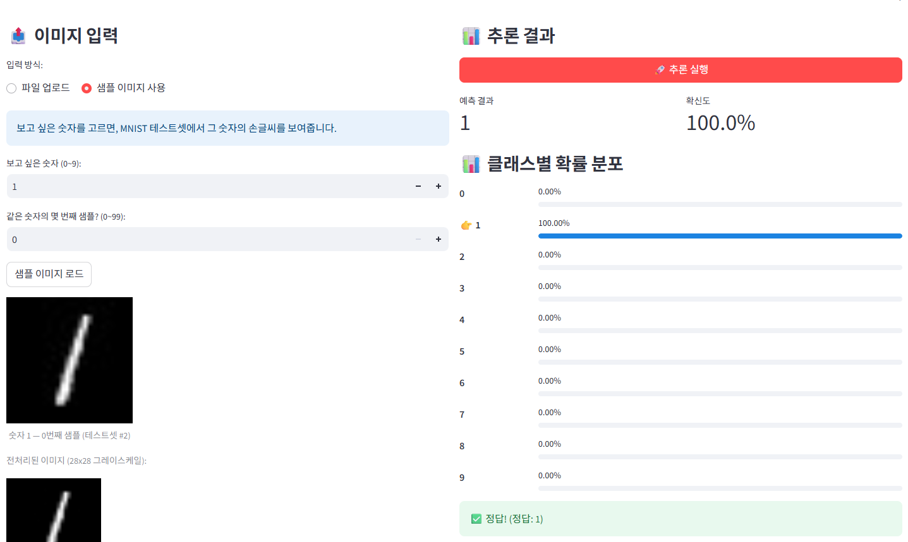
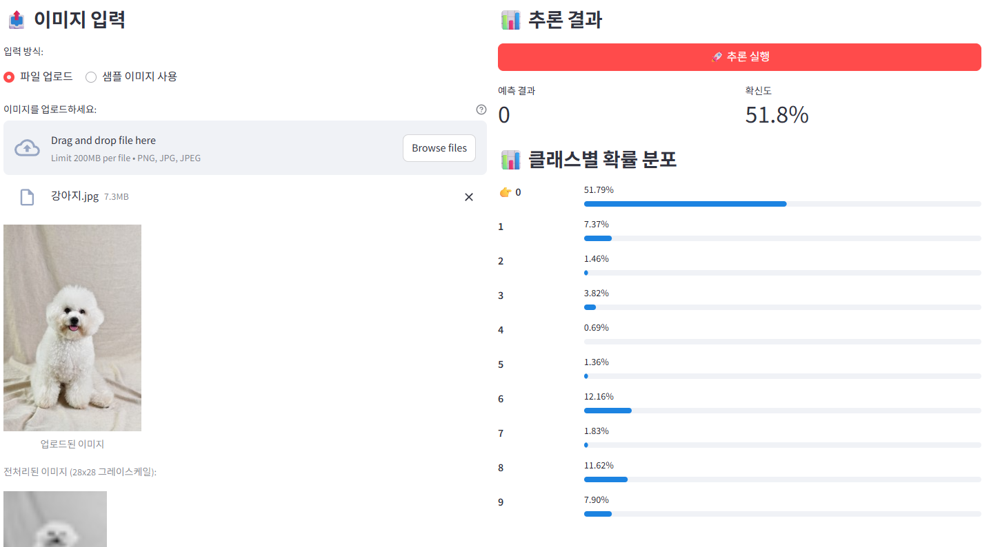
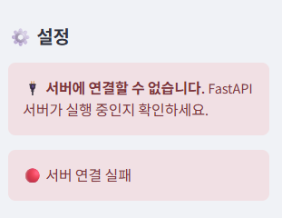

# Day 4: Streamlit과 시스템 아키텍처

Day 1~3에서 만든 MNIST 추론 API를 대상으로 Streamlit 프론트엔드를 구현했다. 사용자는 파일 업로드 또는 MNIST 테스트셋 샘플을 선택해 이미지를 입력하고, Streamlit은 이미지를 Base64로 인코딩해 FastAPI의 `/predict/image` 엔드포인트로 전송한다. FastAPI는 전처리와 모델 추론을 수행한 뒤 JSON 응답을 반환하며, 화면은 예측 클래스·확신도·클래스별 확률을 표시한다.

## 1. 섹션 1 수행내역 — 첫 번째 Streamlit 앱

`frontend/app_hello.py`를 작성해 Streamlit의 기본 실행 방식과 위젯을 확인했다. Streamlit 앱은 주피터 노트북 안에서 직접 실행하는 프로그램이 아니라 독립적인 웹 서버이므로, 프로젝트 루트의 별도 터미널에서 실행한다.

```bat
cd /d D:\Codes\sandbox\model-serving-course
.venv\Scripts\activate.bat
python -m streamlit run frontend\app_hello.py --server.port 8501
```

실행 후 `http://localhost:8501`에서 이름 입력, 상태 메시지, 버튼 클릭을 포함한 기본 웹 UI를 확인할 수 있다. 입력 위젯의 값이 바뀌거나 버튼을 누르면 Streamlit 스크립트는 위에서 아래로 다시 실행된다.

## 2. 섹션 2 수행내역 — 위젯, 레이아웃, 상태 유지

최종 대시보드에는 다음 Streamlit 요소를 사용했다.

```text
사이드바             서버 연결 상태와 표시 옵션
컬럼                 이미지 입력 영역과 추론 결과 영역을 좌우 배치
file_uploader        PNG/JPG/JPEG 파일 업로드
radio, number_input  파일 업로드·샘플 이미지 선택 및 샘플 번호 지정
spinner              추론 요청 중 진행 상태 표시
metric, progress     예측 결과·확신도·클래스별 확률 표시
session_state        재실행 이후에도 샘플 이미지와 마지막 추론 결과 유지
```

특히 샘플 이미지와 마지막 추론 결과는 `st.session_state`에 저장했다. 버튼 클릭마다 전체 스크립트가 재실행되는 Streamlit의 특성 때문에, 상태를 저장하지 않으면 샘플과 결과가 다음 화면에서 사라진다.

## 3. 섹션 3·4 수행내역 — 분리 아키텍처와 API 호출

서비스는 프론트엔드와 백엔드를 분리해 구성했다.

```text
브라우저
  → Streamlit 대시보드 (localhost:8501)
  → POST /predict/image, GET /health
  → FastAPI 서버 (localhost:8000)
  → 이미지 전처리·비동기 모델 추론
  → JSON 응답
  → Streamlit 결과 시각화
```

Streamlit은 모델을 직접 로드하지 않고 `requests`로 FastAPI에만 요청한다. 따라서 UI를 변경할 때는 Streamlit만, 모델 추론 로직을 변경할 때는 FastAPI만 각각 수정·재배포할 수 있다.

`call_api()` 함수는 GET 요청의 타임아웃을 10초, POST 요청의 타임아웃을 30초로 설정했다. 연결 오류, 응답 시간 초과, HTTP 오류를 구분해 사용자에게 Streamlit 메시지로 안내하고, 실패 시 `None`을 반환하도록 구성했다.

```python
image_base64 = base64.b64encode(image_bytes).decode("utf-8")
result = call_api(
    f"{API_BASE}/predict/image",
    json_data={
        "image_base64": image_base64,
        "return_probabilities": show_probabilities,
    },
)
```

## 4. 섹션 5 수행내역 — MNIST 추론 대시보드 실행

백엔드와 프론트엔드를 각각 별도 터미널에서 실행했다.

```bat
:: 터미널 1 — FastAPI 백엔드
cd /d D:\Codes\sandbox\model-serving-course
.venv\Scripts\activate.bat
python -m uvicorn app.main_final:app --port 8000
```

```bat
:: 터미널 2 — Streamlit 프론트엔드
cd /d D:\Codes\sandbox\model-serving-course
.venv\Scripts\activate.bat
python -m streamlit run frontend\app_dashboard.py --server.port 8501
```

### 테스트 1. MNIST 샘플 이미지 추론

서버 연결 후 샘플 이미지 모드에서 숫자 `1`, 첫 번째 샘플을 로드하고 추론을 실행했다. 화면에는 테스트셋의 손글씨 숫자 이미지와 28×28 그레이스케일 전처리 이미지가 표시됐다.

```text
예측 결과: 1
확신도: 100.0%
클래스별 확률: 클래스 1 = 100.00%, 나머지 클래스 = 0.00%
정답 비교: 정답 (정답: 1)
```

MNIST와 동일한 분포의 입력에서 모델이 정확히 동작하고, 예측값·확신도·확률 분포·정답 비교 UI가 모두 정상 출력됨을 확인했다.



### 테스트 2. 일반 이미지 파일 업로드

파일 업로드 모드에서 강아지 사진을 입력하고 추론을 실행했다. 업로드 원본과 28×28 그레이스케일 전처리 이미지가 표시됐고, 모델은 다음과 같이 응답했다.

```text
예측 결과: 0
확신도: 51.8%
상위 확률: 0 = 51.79%, 6 = 12.16%, 8 = 11.62%, 9 = 7.90%
```

이 결과는 파일 업로드와 API 호출 자체는 정상이라는 것을 보여 준다. 다만 모델은 손글씨 숫자(MNIST)로만 학습됐으므로 강아지 사진처럼 학습 분포 밖의 이미지를 숫자 클래스로 분류한다. 51.8%라는 수치는 이 이미지가 실제 숫자 `0`이라는 의미가 아니라, 0~9 중 모델이 상대적으로 0을 가장 높게 선택했다는 뜻이다.



### 테스트 3. 백엔드 미실행 상태

FastAPI 서버가 실행되지 않은 상태에서 대시보드를 열자 사이드바에 `서버에 연결할 수 없습니다. FastAPI 서버가 실행 중인지 확인하세요.`라는 메시지와 `서버 연결 실패` 상태가 표시됐다. 이미지 입력 영역에서도 서버 연결 실패를 다시 안내해, 요청을 보내기 전에 원인을 알 수 있게 했다.

이 결과는 프론트엔드의 헬스체크와 `ConnectionError` 예외 처리가 정상 동작함을 보여 준다.



## 5. 체크포인트 답변

### 섹션 1. Streamlit 소개

#### 1. Streamlit의 스크립트 재실행 모델이란 무엇입니까?

**답변:** 사용자가 입력을 변경하거나 버튼을 클릭할 때마다 Streamlit 앱의 Python 스크립트가 위에서 아래로 다시 실행되는 방식이다. 위젯은 이전 값을 유지하지만, 일반 지역 변수 값은 다시 계산된다.

#### 2. `st.text_input()`에 값을 입력하면 내부적으로 어떤 일이 일어납니까?

**답변:** 입력 이벤트가 발생하고 Streamlit 스크립트가 다시 실행된다. 재실행된 `st.text_input()`은 사용자가 입력한 최신 값을 반환하므로, 이후 코드가 그 값으로 화면을 다시 그린다.

#### 3. `st.set_page_config()`를 스크립트 중간에 호출하면 어떻게 됩니까?

**답변:** 페이지 설정은 첫 번째 Streamlit 호출 전에 한 번만 호출해야 한다. 다른 `st.*` 호출 뒤에 두면 `StreamlitAPIException`이 발생할 수 있다.

### 섹션 2. Streamlit 핵심 컨셉

#### 1. `st.file_uploader()`로 업로드된 파일의 바이트 데이터는 어떻게 얻습니까?

**답변:** 반환된 UploadedFile 객체에서 `uploaded.getvalue()`를 호출하면 바이트 데이터를 얻을 수 있다. 이 바이트를 이미지 미리보기, Base64 인코딩, API 요청에 사용할 수 있다.

#### 2. Streamlit에서 `@st.cache_resource`를 사용하는 이유는 무엇입니까?

**답변:** 스크립트 재실행 때마다 생성하면 비용이 큰 리소스를 앱 실행 중 한 번만 만들고 재사용하기 위해서다. 데이터베이스 연결, API 클라이언트, 모델 객체 등에 적합하다.

### 섹션 3. 시스템 아키텍처

#### 1. 모놀리식과 분리 아키텍처의 핵심 차이를 한 문장으로 설명하세요.

**답변:** 모놀리식은 UI와 모델 추론을 하나의 애플리케이션에서 함께 처리하고, 분리 아키텍처는 프론트엔드와 백엔드를 독립 서비스로 두고 HTTP API로 통신한다.

#### 2. 모델을 업데이트할 때 분리 아키텍처에서는 어떤 서버만 재배포하면 됩니까?

**답변:** 모델 파일과 추론 로직을 담당하는 FastAPI 백엔드 서버만 재배포하면 된다. Streamlit UI는 API 규약이 유지되는 한 변경할 필요가 없다.

#### 3. Streamlit 앱에 PyTorch가 설치되어 있지 않아도 되는 이유는 무엇입니까?

**답변:** Streamlit은 모델을 실행하지 않고, 이미지를 API 요청으로 전달하고 JSON 응답을 표시만 한다. PyTorch와 모델은 FastAPI 서버에서만 필요하다.

### 섹션 4. FastAPI 호출

#### 1. 이미지를 API에 전송할 때 Base64로 인코딩하는 이유는 무엇입니까?

**답변:** 이미지의 이진 바이트를 JSON 본문에 안전하게 담아 HTTP API로 전달하기 위해서다. FastAPI는 Base64 문자열을 다시 디코딩해 이미지 객체로 복원한다.

#### 2. `response.raise_for_status()`는 어떤 역할을 합니까?

**답변:** HTTP 응답 상태가 4xx 또는 5xx이면 `HTTPError` 예외를 발생시킨다. 호출 코드는 성공 응답만 JSON으로 처리하고, 실패 응답은 예외 처리 로직을 통해 사용자에게 안내할 수 있다.

## 6. Day 4 최종 체크포인트

### 섹션 1: Streamlit 소개

#### Q1. Streamlit의 스크립트 재실행 모델이란 무엇입니까?

**답변:** 사용자가 위젯 값을 바꾸거나 버튼을 클릭할 때마다 Streamlit 앱의 Python 스크립트가 위에서 아래로 다시 실행되는 방식이다. 위젯은 현재 값을 보존하지만, 일반 변수는 재실행 과정에서 다시 계산된다.

### 섹션 2: 핵심 컨셉

#### Q2. `@st.cache_resource`를 사용하는 이유는 무엇입니까?

**답변:** Streamlit은 이벤트마다 스크립트를 재실행하므로, 생성 비용이 큰 리소스를 매번 새로 만들지 않고 앱 실행 중 한 번 생성해 재사용하기 위해 사용한다. 데이터베이스 연결, API 클라이언트, 모델 객체가 대표적인 대상이다.

### 섹션 3: System Architecture

#### Q3. 프론트엔드와 백엔드를 분리하는 핵심 이유 두 가지는 무엇입니까?

**답변:** 첫째, UI와 모델 추론 로직을 각각 독립적으로 개발·배포·확장할 수 있다. 예를 들어 모델을 업데이트할 때는 FastAPI만, 화면을 바꿀 때는 Streamlit만 수정하면 된다. 둘째, FastAPI API를 Streamlit뿐 아니라 모바일 앱, 다른 서버, 스크립트 같은 여러 클라이언트가 공통으로 사용할 수 있다.

#### Q4. Streamlit 앱에 PyTorch가 필요 없는 이유는 무엇입니까?

**답변:** Streamlit은 모델을 직접 실행하지 않고, 이미지를 FastAPI에 HTTP 요청으로 전달한 뒤 JSON 응답을 화면에 표시한다. PyTorch와 모델 파일은 전처리와 추론을 수행하는 FastAPI 백엔드에만 필요하다.

### 섹션 4: API 호출

#### Q5. API 호출 실패 시 사용자에게 스택 트레이스가 아닌 메시지를 보여줘야 하는 이유는 무엇입니까?

**답변:** 스택 트레이스에는 파일 경로, 내부 모듈, 라이브러리 정보 같은 구현 세부 사항이 포함될 수 있어 보안상 노출하면 안 된다. 또한 일반 사용자는 기술적인 예외 내용을 해결할 수 없으므로, 서버 연결 실패·시간 초과처럼 원인과 다음 행동을 알 수 있는 메시지를 보여 주는 편이 적절하다.

### 섹션 5: 실습

#### Q6. `st.session_state`에 결과를 저장하는 이유는 무엇입니까?

**답변:** Streamlit은 버튼을 클릭할 때마다 스크립트를 재실행하므로, 일반 변수에만 저장한 추론 결과는 다음 재실행에서 사라진다. `st.session_state["last_result"]`에 결과를 저장하면 같은 사용자 세션 안에서 재실행 후에도 예측값과 확률 분포를 계속 표시할 수 있다.

#### Q7. 이미지를 API로 전달할 때 Base64 인코딩이 필요한 이유는 무엇입니까?

**답변:** 이미지는 이진 바이트 데이터라 JSON 요청 본문에 직접 넣을 수 없다. Base64로 문자열화하면 JSON에 안전하게 담아 전송할 수 있고, FastAPI는 이를 다시 디코딩해 이미지로 복원한 뒤 전처리와 추론을 수행할 수 있다.
