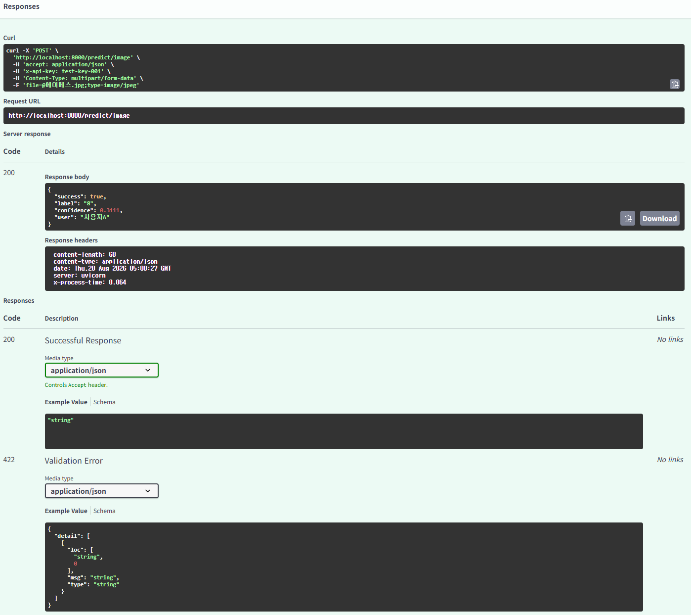

# Day 6 체크포인트 정리

MNIST 이미지 분류 API에 API Key 인증과 안전한 파일 업로드 처리를 적용하며 확인한 체크포인트와 답변이다.

## 1. API 보안의 필요성

### 1. 인증 없는 API가 위험한 이유는 무엇인가?

인증이 없으면 URL을 아는 누구나 모델을 호출할 수 있다. 무단 사용으로 추론 비용이 증가할 수 있고, 대량 요청으로 서비스가 느려지거나 중단될 수 있다. 또한 모델의 동작과 서비스 기능이 의도하지 않은 사용자에게 노출될 수 있다.

### 2. API Key 방식이 ML 추론 API에 적합한 이유는 무엇인가?

클라이언트가 `X-API-Key` 헤더에 키만 전달하면 되므로 구현이 단순하다. 서버는 키별로 호출자를 식별하고 접근을 허용·차단할 수 있으며, 키를 폐기하거나 교체하기도 쉽다. 따라서 내부 서비스 또는 서버 간 ML 추론 API의 기본 인증 방식으로 적합하다.

## 2. API Key 인증 구현

### 1. `Header(None)`에서 `None`은 어떤 상황에서 `x_api_key`에 들어가는가?

클라이언트가 `X-API-Key` 헤더를 보내지 않았을 때 들어간다. FastAPI는 함수 인자 `x_api_key`를 HTTP 헤더 `X-API-Key`에 자동으로 연결한다.

### 2. `Depends(verify_api_key)`를 엔드포인트에 추가하면 요청 처리 흐름이 어떻게 바뀌는가?

`/predict/image` 엔드포인트의 본문보다 먼저 `verify_api_key()`가 실행된다. 키가 없거나 유효하지 않으면 `HTTPException(401)`이 반환되어 파일 처리와 모델 추론은 실행되지 않는다. 인증에 성공하면 반환된 사용자명이 `user` 인자로 전달된다.

### 3. 인증 실패 시 반환하는 HTTP 상태 코드 401의 의미는 무엇인가?

`401 Unauthorized`는 요청에 필요한 인증 정보가 없거나, 제공한 인증 정보가 유효하지 않아 보호된 리소스에 접근할 수 없다는 의미다.

## 3. 파일 업로드와 안전장치

### 1. `UploadFile`과 Base64 방식의 핵심 차이는 무엇인가?

`UploadFile`은 `multipart/form-data`로 파일을 직접 전송한다. Base64는 파일을 문자열로 인코딩해 JSON 등에 담는 방식이므로 인코딩·디코딩 과정이 필요하고 데이터 크기도 증가한다. 파일 업로드 API에서는 `UploadFile`이 더 자연스럽고 효율적이다.

### 2. `file.content_type`으로 타입을 검증하는 이유는 무엇인가?

이미지가 아닌 텍스트나 실행 파일 같은 입력을 초기에 차단하기 위해서다. 다만 MIME 타입은 위조될 수 있으므로, 이 실습처럼 PIL로 실제 파일을 열어 이미지 디코딩까지 확인해야 한다.

### 3. 파일 크기를 제한하지 않으면 어떤 문제가 발생할 수 있는가?

대용량 업로드가 네트워크·메모리·임시 디스크를 과도하게 사용해 응답이 느려지거나 서비스 장애로 이어질 수 있다. 이번 실습에서는 최대 크기를 5MB로 제한했다.

## 4. 최종 체크포인트

### Q1. API Key 인증이 없으면 어떤 위험이 있는가? (두 가지 이상)

누구나 추론 API를 무단으로 사용해 비용을 발생시킬 수 있고, 대량 요청으로 서비스 성능 저하 또는 장애를 일으킬 수 있다. 또한 보호해야 할 모델 기능과 서비스 동작이 외부에 노출될 수 있다.

### Q2. `Depends(verify_api_key)`는 엔드포인트 실행 전에 어떤 일을 하는가?

요청 헤더에서 API Key를 추출해 유효성을 검사한다. 키가 유효하면 사용자 정보를 엔드포인트에 전달하고, 키가 없거나 틀리면 `401` 응답으로 요청을 중단한다.

### Q3. `UploadFile` 방식이 Base64보다 편리한 점은 무엇인가?

파일을 별도의 문자열 인코딩 없이 직접 전송할 수 있어 요청 형식이 자연스럽고, Base64 인코딩으로 발생하는 용량 증가와 변환 작업을 피할 수 있다.

### Q4. 파일 업로드 시 크기 제한을 하지 않으면 어떤 문제가 생기는가?

악의적이거나 실수로 업로드된 대용량 파일이 서버 자원을 소모해 서비스가 느려지거나 장애가 발생할 수 있다.

### Q5. 이미지를 28x28 그레이스케일로 변환하는 이유는 무엇인가?

사용한 MNIST 모델은 28x28 크기의 흑백 숫자 이미지를 기준으로 학습됐다. 추론 시에도 입력 크기와 채널 수를 학습 환경과 동일하게 맞춰야 올바른 예측을 할 수 있다.

## 수행 내역 및 검증 결과

### 1. 서버 및 모델 초기화

`serve_in_thread("app.image_api:app", port=8000)`을 실행해 FastAPI 서버를 시작했다. 시작 과정에서 `models/mnist_state_dict.pth`의 MNIST 모델을 정상적으로 로드했고, 서버는 `http://127.0.0.1:8000`에서 실행됐다.

### 2. 인증 없는 요청 검증

`X-API-Key` 헤더 없이 `/predict/image`에 요청한 결과, 상태 코드 `401`과 API Key가 필요하다는 응답을 확인했다.

```text
상태 코드: 401
응답: {'detail': 'API Key가 필요합니다. X-API-Key 헤더를 포함해 주세요.'}
```

### 3. 잘못된 API Key 검증

`wrong-key`를 전달한 결과, 상태 코드 `401`과 유효하지 않은 API Key라는 응답을 확인했다.

```text
상태 코드: 401
응답: {'detail': '유효하지 않은 API Key입니다.'}
```

### 4. 정상 이미지 분류 요청

MNIST 테스트 데이터의 첫 번째 이미지(정답 `7`)를 `test-key-001`과 함께 전송했다. API는 상태 코드 `200`을 반환했고, `label`을 `7`, 확신도를 `1.0`으로 응답했다.

```text
테스트 이미지 정답: 7
상태 코드: 200
예측 결과: {'success': True, 'label': '7', 'confidence': 1.0, 'user': '사용자A'}
```

### 5. 잘못된 파일 형식 검증

`text/plain` 형식의 파일을 전송한 결과, 이미지 형식이 아니라는 이유로 상태 코드 `400`을 반환했다.

```text
상태 코드: 400
응답: {'detail': "지원하지 않는 파일 형식입니다: text/plain. 허용 형식: {'image/png', 'image/jpeg'}"}
```

### 6. 연속 이미지 추론 테스트

MNIST 테스트 이미지 5장을 연속으로 전송했다. 각 이미지의 정답과 예측값이 모두 일치했다.

```text
이미지 0: 정답=7, 예측=7, 확신도=1.0000 ✅
이미지 1: 정답=2, 예측=2, 확신도=1.0000 ✅
이미지 2: 정답=1, 예측=1, 확신도=1.0000 ✅
이미지 3: 정답=0, 예측=0, 확신도=1.0000 ✅
이미지 4: 정답=4, 예측=4, 확신도=1.0000 ✅
```

### 7. Swagger UI 테스트 (섹션 6.8)

서버의 Swagger UI는 `http://localhost:8000/docs`에서 확인했다. `POST /predict/image`의 `Try it out`을 선택한 뒤 `x-api-key`에 `test-key-001`을 입력하고 이미지 파일을 업로드해 API를 테스트할 수 있다.



## 회고

이번 실습에서는 이미지 분류 모델을 단순히 호출하는 수준을 넘어, 인증과 파일 검증을 포함한 배포 API로 확장했다. `Depends()`를 사용하면 인증 로직을 엔드포인트와 분리하면서도 요청 처리 전에 일관되게 적용할 수 있다는 점을 확인했다. 또한 파일 업로드는 MIME 타입, 크기, 실제 이미지 디코딩을 함께 검증해야 하며, 모델의 학습 입력 형식에 맞춰 28x28 그레이스케일과 정규화 전처리를 재현해야 한다는 점을 배웠다.
