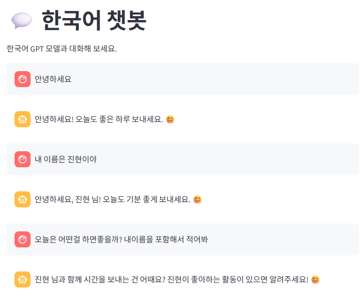
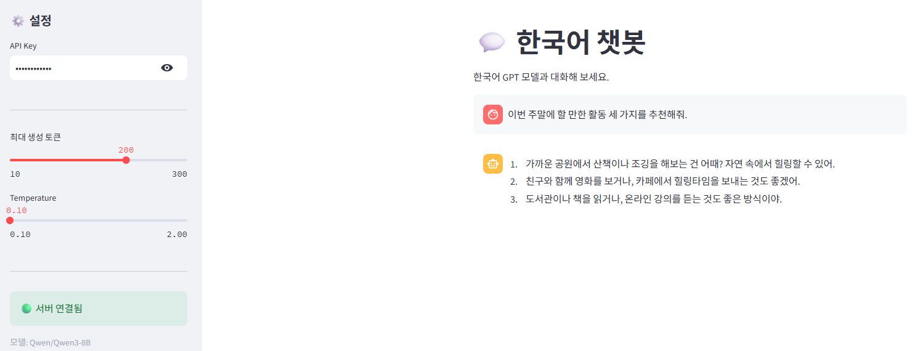
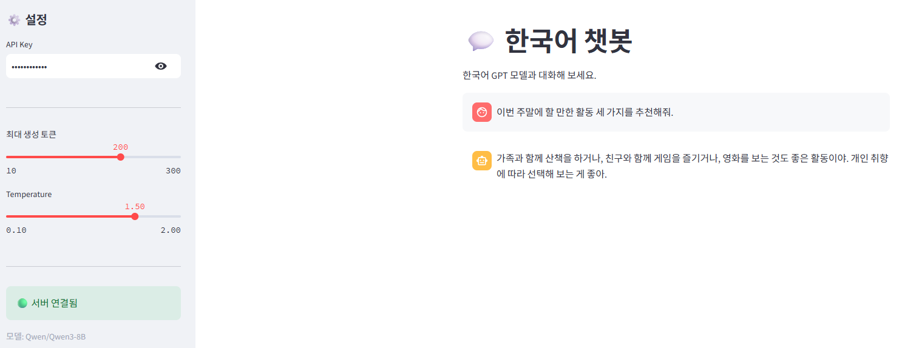
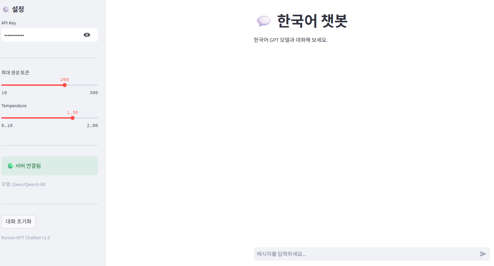
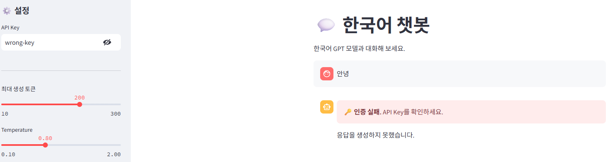

# Day 7 — 트랜스포머 챗봇 서비스

## 프로젝트 개요

- 모델: `Qwen/Qwen3-8B`
- 실행 환경: `cuda:1` (NVIDIA TITAN RTX), `torch.float16`
- 백엔드: FastAPI + API Key 인증
- 프론트엔드: Streamlit 채팅 UI
- 핵심 흐름: 대화 기록 전송 → 채팅 템플릿/토크나이징 → 모델 생성 → 응답 표시

---

## 1. 테스트 1~4 결과

### 테스트 1. 인증

| 시나리오 | 기대 결과 | 실행 결과 | 판정 |
| --- | --- | --- | --- |
| API Key 없음 | `401 Unauthorized` | HTTP `401` | 통과 |
| 잘못된 API Key | `401 Unauthorized` | HTTP `401` | 통과 |
| 올바른 API Key (`test-key-001`) | 정상 응답 | HTTP `200` | 통과 |

정상 키로 요청했을 때 한국어 응답이 생성되었고, 인증되지 않은 요청은 모델 추론 전에 차단되었다.

### 테스트 2. 멀티턴 대화

`안녕하세요!` → `오늘 뭐 하면 좋을까?` → `맛있는 거 추천해줘` 순서로 대화를 전송했다. 서버 로그에서 메시지 수가 `1 → 3 → 5`로 증가했고, 총 3턴의 응답이 정상 생성되었다.

| 확인 항목 | 결과 |
| --- | --- |
| 이전 대화 기록 포함 | 정상 |
| 각 요청의 HTTP 상태 | `200` |
| 총 대화 턴 | 3턴 |

### 테스트 3. 입력 검증

| 시나리오 | 실행 결과 | 판정 |
| --- | --- | --- |
| 빈 `messages` 목록 | HTTP `422` | 통과 |
| `temperature=5.0` | HTTP `422` | 통과 |

Pydantic 스키마의 입력 범위 검증이 모델 호출 전에 동작함을 확인했다.

### 테스트 4. 동시 요청

4개의 요청을 동시에 전송했고 모든 요청이 HTTP `200`으로 완료되었다.

| 요청 | 응답 시간 | 상태 |
| --- | ---: | --- |
| #1 | 6.3초 | `200` |
| #2 | 4.4초 | `200` |
| #3 | 6.7초 | `200` |
| #4 | 4.7초 | `200` |

전체 완료 시간은 약 6.7초였다. FastAPI 이벤트 루프를 직접 막지 않고 `ThreadPoolExecutor`에서 모델 추론을 실행하도록 구성한 결과, 여러 요청을 처리할 수 있었다.

---

## 2. UI 테스트 캡처 결과

### 테스트 A. 기본 대화 및 멀티턴

이전 대화에서 입력한 이름 `진현`이 다음 응답에 반영되었다. Streamlit의 `st.session_state`가 화면 재실행 사이에서도 대화 기록을 유지하고, UI가 전체 기록을 API에 전달함을 확인했다.

### 테스트 B. Temperature 변경

같은 질문(이번 주말에 할 만한 활동 세 가지 추천)을 Temperature `0.1`과 `1.5`에서 각각 요청했다.

- `0.1`: 산책, 영화/카페, 도서관/책을 번호로 제시하는 비교적 구조화된 응답이 생성되었다.
- `1.5`: 산책, 게임, 영화 등의 활동을 한 문장에 묶는 다른 구성의 응답이 생성되었다.

Temperature는 다음 토큰 선택의 확률 분포를 조절한다. 따라서 값이 높다고 반드시 더 긴 답변이나 더 창의적인 답변이 나오는 것은 아니며, 짧은 단일 응답에서는 차이가 작게 보일 수 있다.

### 테스트 C. 대화 초기화

`대화 초기화` 버튼을 누른 뒤 기존 채팅 기록이 사라지고 초기 입력 화면으로 돌아오는 것을 확인했다.

### 테스트 D. 인증 실패

API Key를 `wrong-key`로 변경한 뒤 메시지를 전송했다. UI에 `🔑 인증 실패. API Key를 확인하세요.`가 표시되어, 백엔드의 `401` 응답을 사용자 친화적인 오류 메시지로 처리함을 확인했다.

---

## 3. 전체적인 체크포인트 답변

### 챗봇 API

1. `ChatRequest.messages`가 리스트인 이유는 무엇인가?
   - 멀티턴 챗봇은 현재 질문만으로 답하지 않고 이전 사용자/봇 대화의 순서와 맥락을 함께 사용해야 한다. 따라서 메시지를 순서가 보장된 리스트로 받는다.

2. 서버가 대화 기록을 저장하지 않고 클라이언트가 매번 전체 기록을 보내는 이유는 무엇인가?
   - 서버를 무상태(Stateless)로 유지하면 여러 서버 인스턴스로 쉽게 확장할 수 있고, 특정 서버가 종료되어도 세션 정보를 잃지 않는다. 대신 대화가 길어질수록 전송량과 토큰 사용량이 증가하므로 오래된 대화를 자르는 정책이 필요하다.

3. `max_new_tokens`를 너무 크게 설정하면 어떤 문제가 발생하는가?
   - 응답 시간이 길어지고, 생성 중 사용하는 KV cache가 커져 GPU 메모리 부족 가능성이 높아진다. 불필요하게 긴 응답과 비용 증가도 발생할 수 있다.

### Streamlit UI

1. `st.chat_message`와 `st.chat_input`의 역할은 무엇인가?
   - `st.chat_message`는 user/assistant 역할에 맞춰 기존 대화와 새 응답을 표시한다. `st.chat_input`은 사용자가 새 메시지를 입력하는 채팅 전용 입력창이다.

2. `st.session_state["chat_messages"]`에 대화 기록을 저장하는 이유는 무엇인가?
   - Streamlit은 사용자 상호작용마다 스크립트를 다시 실행한다. `session_state`에 저장하지 않으면 화면이 재실행될 때 대화 기록이 사라진다.

3. 대화 초기화 버튼이 `st.rerun()`을 호출하는 이유는 무엇인가?
   - 대화 목록을 빈 리스트로 바꾼 직후 스크립트를 다시 실행해, 이전 메시지가 없는 초기 화면을 즉시 보여주기 위해서다.

### API Key 인증 및 오류 처리

1. 인증 실패 시 서버는 어떤 상태 코드를 반환하는가?
   - `401 Unauthorized`를 반환한다.

2. UI의 `call_chat_api()`는 `401` 응답을 받으면 무엇을 보여주는가?
   - `🔑 인증 실패. API Key를 확인하세요.`라는 오류 메시지를 표시한다.

3. Day 6의 인증 모듈을 Day 7에서 수정 없이 재사용할 수 있는 이유는 무엇인가?
   - 인증은 특정 모델이나 엔드포인트의 비즈니스 로직과 분리된 공통 관심사다. `Depends(verify_api_key)`로 주입하므로 동일한 인증 함수를 챗봇 API에도 그대로 연결할 수 있다.

---

## 4. Day 7 최종 체크포인트 답변

1. **Day 5의 정형 데이터와 Day 7의 텍스트 생성에서 전처리 방식은 어떻게 다른가?**
   - Day 5는 입력 숫자의 순서를 고정하고 학습 때 사용한 평균·표준편차로 정규화한다. Day 7은 자연어 대화 기록을 모델의 채팅 템플릿에 맞추고, 토크나이저로 토큰 ID로 변환한다.

2. **멀티턴 대화에서 서버가 상태를 유지하지 않는 이유는 무엇인가?**
   - 클라이언트가 전체 대화 기록을 보내는 무상태 방식은 수평 확장과 장애 복구가 쉽다. 반면 긴 대화에서는 컨텍스트 윈도우와 토큰 비용을 관리해야 한다.

3. **API Key가 잘못되면 서버와 UI는 어떻게 처리하는가?**
   - 서버는 모델 추론을 수행하지 않고 HTTP `401`을 반환한다. UI는 이를 받아 API Key를 확인하라는 인증 실패 메시지를 표시한다.

4. **Temperature를 낮추면 생성 결과가 어떻게 바뀌는가?**
   - 확률이 높은 토큰을 더 우선해 선택하므로, 답변이 비교적 일관되고 보수적으로 생성된다. 높이면 후보 선택이 다양해지지만 매번 더 창의적이거나 더 좋은 답변을 보장하지는 않는다.

5. **이 서비스를 다른 컴퓨터에서 실행하려면 무엇이 필요한가?**
   - 프로젝트 코드와 Python 의존성(`torch`, `transformers`, `fastapi`, `uvicorn`, `streamlit` 등), 모델 다운로드 또는 Hugging Face 캐시, API Key 설정이 필요하다. Qwen3-8B는 모델 크기에 맞는 GPU 메모리 또는 충분한 CPU/RAM 환경도 필요하다.

---

## 5. 회고

이번 실습에서는 Hugging Face의 Qwen3-8B 모델을 FastAPI와 Streamlit으로 연결해 멀티턴 챗봇 서비스를 구현했다. 단순히 모델을 로드하는 것을 넘어, 대화 기록을 API 요청으로 전달하는 무상태 구조와 UI의 `session_state`가 서로 다른 역할을 한다는 점을 이해했다.

모델을 변경하는 과정에서는 GPU 선택, FP16 dtype 설정, 같은 커널에서 모델을 두 번 로드했을 때 발생하는 CUDA Out Of Memory 문제를 경험했다. 특히 서버를 중지해도 모델 객체의 참조가 남으면 GPU 메모리가 바로 해제되지 않을 수 있어, 서버 생명주기와 객체 참조 관리의 중요성을 알게 되었다.

또한 Qwen3의 thinking 모드가 사용자 응답에 노출되는 문제를 `enable_thinking=False`로 제어했다. 모델의 기본 동작을 그대로 사용하는 것이 아니라, 서비스 목적에 맞는 출력 형식·토큰 수·동시 요청 수를 설정해야 한다는 점이 인상적이었다.
